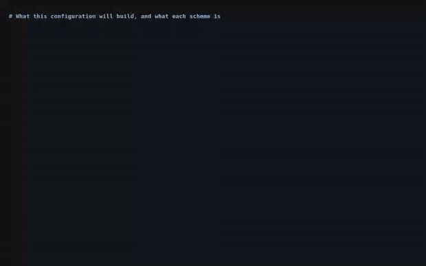
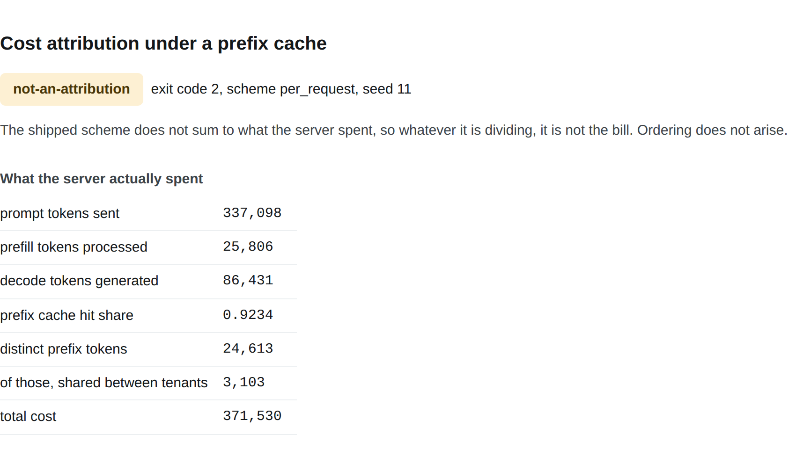
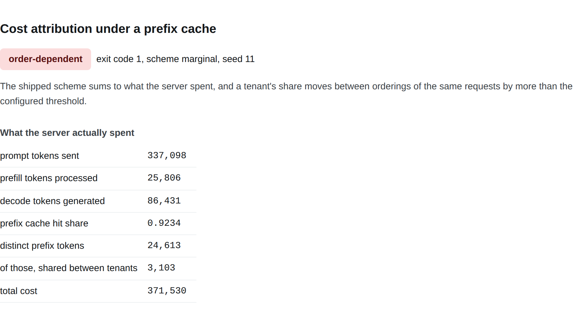
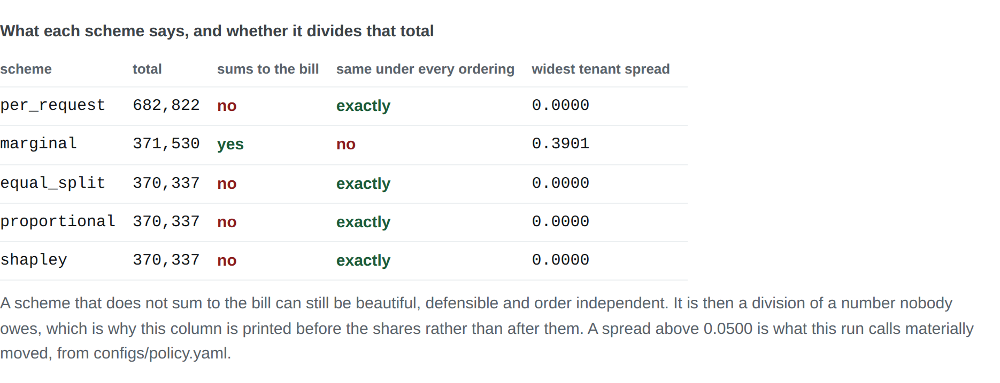
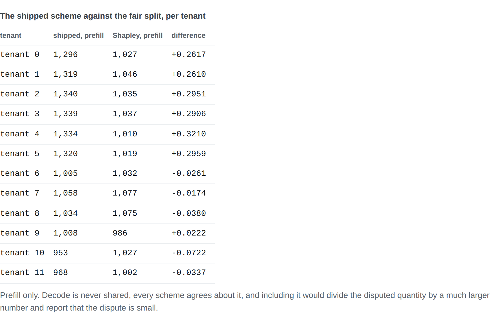
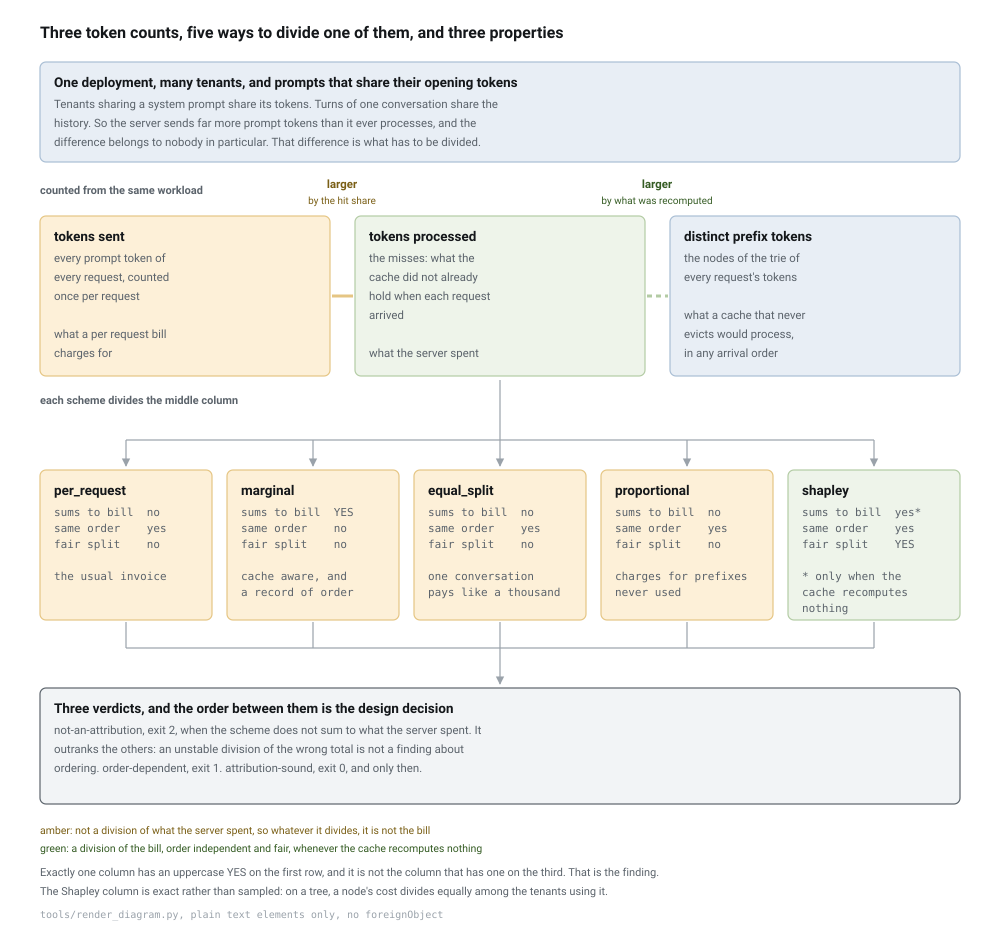
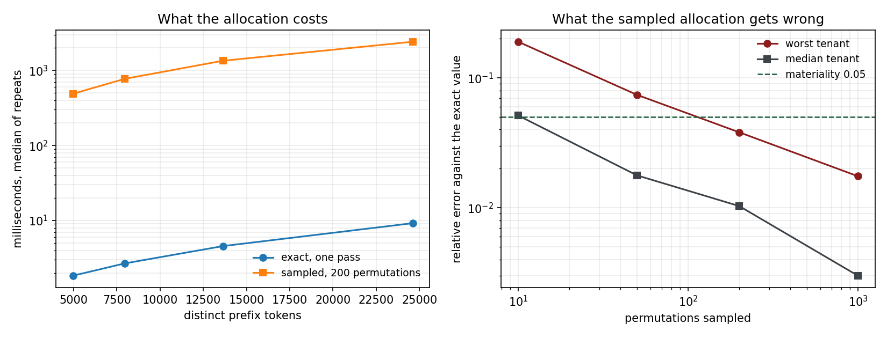

# prefix-cost-attribution

**A cost attribution audit for LLM serving with a prefix cache, which shows that the only bill that sums to what the server actually spent is one that charges a tenant differently depending on who arrived first, and returns exit 2 rather than a green tick when the scheme it was handed is not a division of anything.**

[](https://github.com/srujan20/prefix-cost-attribution/actions/workflows/ci.yml)
[](#tests-coverage-and-receipts)
[](#tests-coverage-and-receipts)
[](#every-number-here-is-checked-by-ci)
[](#the-three-verdicts-on-real-runs)
[](LICENSE)

## What this solves

- **Your invoice is not a division of what the server spent.** With a prefix cache on, a per request token count **collects 1.8378 times** the real cost, which is **0.8379 more than the server** ever paid for. On the prefill line alone it charges **13.7723 times the fair share**, and its **worst line is 15.1728 times**. Nobody is credited with the difference. It is not fraud, it is what happens when the billing code was written before the cache was.
- **The one scheme that does add up charges for arrival order.** Charge each request for the tokens actually processed and the shares sum to the spend exactly. They also move: the median tenant's share **moves by 0.3494 of its own** value across **12 arrival orders** of the same requests, the **worst tenant moves 0.4975**, and one was **charged 813 in one arrival order** **and 1,336 in another** for identical usage. Across every prompt family in every replay, that scheme puts the **first arriver top in 360 of** **of 360 family replays**, where **chance would be 0.25**.
- **The fair split is fair, stable, and quietly short.** The exact Shapley value of the cost game on the prefix trie is order independent across all **120 tenant observations**, **120 of them exactly** unchanged to the last bit. At the shipped capacity it also **fair split collects 0.9964** of what the server spent: it is **short of the bill by 0.0036**, and the provider absorbs that. Across **24 configurations** of tenants, prompt families and cache size, no scheme had all three properties in any of the **13 of them recompute** a cached prefix.

## Executive summary

A prefix cache makes serving cheaper by never computing the same prompt prefix twice. Tenants sharing a system prompt share its tokens, and every turn of a conversation resends the history the previous turn already paid for. On the shipped corpus, **24 tenants** across **6 prompt families** send **960 requests** carrying **337,098 prompt tokens**, of which the server at **capacity of 8,000 tokens** **actually processes 25806** at a prefix cache **hit share of 0.9234**, after **17,806 evictions**. The cache saved about ninety three percent of the prefill work. The question this repository is about is who that saving belongs to, and the answer every provider ships is: nobody, we keep it.

That is defensible as a commercial choice and indefensible as a bill, and the difference matters the moment a customer asks how their number was computed. Charge each request for every token it sent and you have a stable, explicable invoice that **collects 1.8378 times** the spend. Charge each request for the tokens the server actually processed for it and the total is exactly right and the split is a record of scheduling: whichever tenant happened to arrive first with a shared system prompt paid to compute it and everyone behind them got it free. Measured over **120 tenant observations**, that scheme moved a median tenant's bill by **0.3494 of its own** value depending only on replay order, with a **rank correlation of -0.2338 with** how early the tenant was, **against 0.0037 for the fair** split.

The uncomfortable result is that you cannot have everything. Sum to the spend, do not depend on arrival order, split shared work fairly: across **24 configurations**, no scheme had all three in any of the **13 of them recompute** an evicted prefix, and the exact Shapley value **has all three in 0 of the** recomputing cells while having **all three in 11 of** the eleven that do not. So the honest recommendation is not a scheme, it is a boundary: the conflict is created by recomputation, and a cache large enough that nothing is computed twice dissolves it. **105 tests**, **99.9 percent line coverage**, and `make verify` re-measures every figure quoted in this document, in the defense guide, in the policy file and in five decision records, and fails if any of them has moved.

## Watch it work (about 25 seconds)



Every line of terminal text above is real captured stdout from a command that ran, with each segment paced by that command's measured wall time. It is a replay of a captured session rather than a live screen recording, and [`docs/video/manifest.json`](docs/video/manifest.json) lists each command with its exit code and measured duration. Higher quality MP4: [`docs/video/demo.mp4`](docs/video/demo.mp4).

## The three verdicts on real runs

**The bill almost everybody sends. Exit code 2.** It does not sum to what the server spent, so the question of whether it is stable or fair never arises.



```
$ python -m prefixcost audit --seed 11 --scheme per_request
verdict: not-an-attribution
exit code: 2, scheme per_request, seed 11

what the server actually spent
  prompt tokens sent      : 337098
  prefill tokens processed: 25806
  prefix cache hit share  : 0.9234
$ echo $?
2
```

**The bill a cache aware team arrives at. Exit code 1.** The total is exactly right. The split is partly a record of who was scheduled first.



**Five divisions of one number, side by side.** This table is the whole repository in five rows. Exactly one scheme sums to the bill, and it is the only one whose widest tenant spread is not zero.



**What a customer would actually see.** The shipped scheme against the fair split, per tenant, on the prefill line where the disagreement lives.



[`docs/screenshots/manifest.json`](docs/screenshots/manifest.json) records which report each image came from, the headings it was framed by, and the measured contrast ratio of the verdict badge in it. The capture script fails the run if a badge is invisible or falls below a contrast ratio of 4.5, because the screenshot tool is the only thing in this pipeline that can see pixels.

## Architecture



<details>
<summary>the diagram source, and why this is a committed image</summary>

There is no mermaid fence here, and that is a decision rather than an omission. GitHub renders mermaid itself, and when it works the source is the picture, which is the better arrangement. It does not always work: a diagram that parses under mermaid versions ten and eleven locally can still come back from GitHub as "Unable to render rich display", which is a failure inside their renderer that nothing in this repository can fix. Three smaller traps pushed the same way. A diagram with HTML labels is not well formed XML, because the labels sit in a `foreignObject` with unclosed `br` tags, and it then displays when injected into a live page and fails silently as an `img src`, with `naturalWidth` 0 and nothing in any console. An `img src` with a percentage width and no intrinsic height leaves the browser without an aspect ratio. And a transparent background is not theme neutral, because light node fills with dark text come out as dark grey on near black in a dark theme.

So `tools/render_diagram.py` emits the SVG by hand, with plain `text` elements, intrinsic dimensions, and one opaque rectangle covering the whole viewBox. It renders identically on GitHub, in an editor preview, in the PDF and offline. The layout it draws, which is the source in the sense that matters:

```diagram-source name=architecture
one deployment, many tenants, prompts that share their opening tokens

three token counts, from the same workload
  tokens sent             every prompt token of every request, once per request
                          what a per request bill charges for
  tokens processed        the misses: what the cache did not already hold
                          what the server spent
  distinct prefix tokens  the nodes of the trie of every request's tokens
                          what a cache that never evicts would process,
                          in any arrival order

each scheme divides the middle column
  per_request    sums to bill no    same order yes   fair no
  marginal       sums to bill YES   same order no    fair no
  equal_split    sums to bill no    same order yes   fair no
  proportional   sums to bill no    same order yes   fair no
  shapley        sums to bill yes*  same order yes   fair YES
                 * only when the cache recomputes nothing

three verdicts
  not-an-attribution  exit 2   the scheme does not sum to the spend.
                               Outranks the others
  order-dependent     exit 1
  attribution-sound   exit 0   and only then
```

Regenerating the image after editing that layout is one command: `python tools/render_diagram.py`.

</details>

Exactly one column has an uppercase YES on the first row, and it is not the column that has one on the third. That is the finding, and everything below is the measurement of it.

## What the measurement told me to throw away

This is the section I would most want reviewed, because two of these were things I had already written down and one was a defect in the cache model this whole repository is built on.

**Rejected: a cache that stores whole prompts.** It was my first implementation and it is a model of a request cache wearing a prefix cache's name. A real prefix cache holds key and value blocks per token position, so any prefix computed before is reusable, including one that no request ever sent on its own: turn two of a conversation computes a prefix that turn three reuses. The whole prompt version reported 28,504 prefill tokens under an unbounded cache where the trie reports **24,613 distinct prefix tokens**, understating reuse by about a quarter, and every attribution built on it was dividing a total that was too large. The full story is in ADR-001.

**Rejected: a comfortable default capacity.** The shipped capacity was 60000 tokens, above this workload's working set, so the cache never evicted. That is the one configuration in which the three properties stop conflicting, which made it a default that hid the finding. The sweep is what showed it:

| capacity | lru prefill | oracle prefill | what the policy costs | evictions |
| --- | --- | --- | --- | --- |
| 0 | 337098 | 337098 | 0.0 | 0 |
| 1,000 | 32077 | 29907 | 0.0726 | 31077 |
| 2,000 | 32062 | 26491 | 0.2103 | 30062 |
| 4,000 | 31985 | 24613 | 0.2995 | 27985 |
| 8,000 | 25806 | 24613 | 0.0485 | 17806 |
| 12,000 | 25137 | 24613 | 0.0213 | 13137 |
| 16,000 | 24683 | 24613 | 0.0028 | 8683 |
| 20,000 | 24613 | 24613 | 0.0 | 4613 |
| 24,613 | 24613 | 24613 | 0.0 | 0 |
| 32,000 | 24613 | 24613 | 0.0 | 0 |

The shipped capacity is now 8,000, which is **0.33 of the working set** and the regime a deployment whose prompts outgrew its cache is actually in. Two things fall out of that table that no single prefill number could have said. **eviction stops at 24,613**, which is the trie's node count exactly rather than approximately. And the fair split becomes **a bill again from 20,000**, where LRU is **still evicting 4,613 nodes**: what breaks efficiency is recomputing an evicted prefix, not evicting one. Reproduce with `python experiments/exp03_the_policy_not_the_capacity.py`.

**Rejected: correlating a tenant's charge with its average arrival position.** The first version of the fairness experiment averaged each tenant's position over twelve replays and correlated that against its bill. Averaging makes every tenant's position nearly identical, so the correlation came out at 0.0013 and appeared to exonerate the scheme the previous experiment had just caught swinging a bill by half its value. The question is whether a tenant that is early *in a given replay* is charged more *in that replay*, and it has to be asked one replay at a time. Asked that way the answer is a **rank correlation of -0.2338 with** arrival position, **against 0.0037 for the fair** split, and the sharper form of it is the family table below.

**Kept: `equal_split` and `proportional`, which are not recommended.** They are what a finance team reaches for when told some cost is shared, and deleting them would leave the comparison with only the two extremes. Both are order independent and neither is fair: on the per tenant table `equal_split` charges a tenant with one conversation the same share of the common prompt as a tenant with a thousand, and `proportional` charges a tenant for shared prefixes it never used, in proportion to usage it incurred somewhere else.

## Method: what each scheme is a function of

A scheme is a function of the data it is given, and that bounds what it can possibly be right about, whatever arithmetic sits on top. The table is mechanical rather than a matter of opinion.

| Scheme | Reads | May therefore claim | May not claim |
| --- | --- | --- | --- |
| `per_request` | the tokens each request sent | every tenant is charged for what it asked for | to be a division of anything the server spent, once a cache is on |
| `marginal` | the tokens the server processed for each request | the shares sum to the spend, exactly | that two tenants with identical usage are charged the same, because the cache state each met is a fact about arrival order |
| `equal_split` | the trie, and how many tenants use each node | shared work is shared, and the answer does not move | that the split is proportionate to anything, since one conversation pays like a thousand |
| `proportional` | the trie, and each tenant's own token count | a heavy user pays more, and the answer does not move | that a tenant is only charged for prefixes it used |
| `shapley` | the trie, and which tenants pass through each node | the unique split that is symmetric, gives a dummy nothing, and is additive | to sum to the spend when the cache recomputed a prefix it had already computed |

That last row is the honest boundary, and it is the one this repository ends on rather than the one it started from.

### The two exact anchors, which is what makes the rest measurements

Two quantities here are exact rather than estimated, and both are integers.

With no cache at all, the prefill is the **337,098 prompt tokens** the workload sent. Nothing is reused, so the tokens processed and the tokens sent are the same number, and a per request bill and a work based bill agree exactly rather than approximately.

With a cache large enough never to evict, the prefill is the **24,613 distinct prefix tokens** in the trie of all request token sequences. Each distinct prefix token is computed once and reused thereafter, in any arrival order. The suite asserts both on the nose, and the second is checked **under 96 permutations** as well, because a quantity that is a property of the request set cannot depend on the order the requests arrived in, and the fact that it cannot is what makes it usable as an anchor.

The caveat belongs next to the numbers rather than three sections later. The corpus **reuses 0.9278 of** its prompt tokens, and **3103 of those prefix tokens** are used by more than one tenant, **shared between tenants, which is 0.126** of the trie. Those magnitudes are properties of this corpus and of the tokeniser trained on it, and the tokeniser is trained here rather than downloaded, for reasons in ADR-003. What transfers to a real deployment is the structure and the method, not the constants.

### The bill is the arrival order, stated as sharply as it can be

Tenants sharing a prompt family share its opening tokens, so in any given replay exactly one of them pays to compute them: whichever arrives first. That gives a test with an exact null. In a family of four, chance alone would put the first arriver top of its family a quarter of the time.

| scheme | collects, against the spend | median tenant spread across orderings | median ratio to the fair share | first arriver pays the most |
| --- | --- | --- | --- | --- |
| `per_request` | 1.8378 | 0.0 | 13.7723 | 0.2528 |
| `marginal` | 1.0 | 0.3494 | 0.9704 | 1.0 |
| `equal_split` | 0.9964 | 0.0 | 1.0037 | 0.2222 |
| `proportional` | 0.9964 | 0.0 | 1.0029 | 0.2222 |
| `shapley` | 0.9964 | 0.0 | 1.0 | 0.2167 |

The efficient scheme puts the **first arriver top in 360 of** **of 360 family replays**, against a **chance would be 0.25** and a **fair split does it 0.2167** of the time, which the interval around it does not distinguish from chance. Not "usually" and not "significantly more often than chance": every single time. The bill is not partly a record of arrival order, on this corpus it is one. Reproduce with `python experiments/exp04_who_pays_the_surplus.py`.

### The boundary, swept rather than argued

Three properties, checked directly rather than reasoned about, across a grid of tenant counts, prompt family counts and cache capacities. Efficient: the shares sum to the spend to one part in a million. Order independent: the shares are identical to the last bit under every replay. Fair: the shares equal the exact Shapley value.

Across **24 configurations**, **13 of them recompute** a prefix the cache had already computed. In those thirteen the fair split **has all three in 0 of the** cells, and so does everything else. In the other eleven it has **all three in 11 of** them, and nothing else has all three anywhere.

So the boundary is not a property of a scheme, it is a property of the cache: a scheme has all three exactly when the cache never recomputes. That is an actionable answer, which an impossibility theorem would not have been. Reproduce with `python experiments/exp05_no_scheme_has_all_three.py`.

## Tech stack

| Technology | Role in this project | Why chosen here |
| --- | --- | --- |
| Python 3.11, 3.12, 3.13 | the whole tool | it has to install next to a serving stack, and the suite runs on all three because it asserts identities and properties rather than values |
| numpy | the corpus draw, the arrival order permutations, the rank correlations | the only place randomness enters, so the whole corpus is one seeded generator away from reproducible |
| PyYAML | the policy file | the pricing, the capacity and the materiality threshold are the subject of this repository, so they cannot live in code where a reader has to trust a diff to find them |
| no tokeniser dependency | byte pair encoding, trained from the committed corpus at load time | a cost repository whose token counts come from a downloaded artefact has made every number a claim about a file the reader cannot inspect. ADR-003 covers what that costs, and `vocabularies.py` is the opt in path to a real one |
| a hand written prefix trie | the cache, and the cost game the fair split is computed on | it is the one structure that makes the unbounded case an identity rather than an estimate, and it is what turns an exponential allocation into one pass |
| pytest, pytest-cov | **105 tests**, **99.9 percent line coverage** | the most valuable one asserts the Shapley identity against the definition by averaging over all 120 permutations of five players, and it duplicates the formula rather than importing it |
| ruff | lint and format, on `src`, `tests`, `tools`, `experiments` and `benchmark` | one tool, one config, and no argument about style in review |
| GitHub Actions | three Pythons on a lean install, then a pinned receipts job | the matrix is the configuration that catches an optional dependency imported at module scope; the receipts job re-measures every published figure with exact pins |
| GitHub Actions composite action | distribution | `action.yml` makes this five lines in another repository, which is the difference between a demo and a tool |
| Playwright with Chromium | the report screenshots in `tools/` | the only way to check that a verdict badge is legible is to look at the pixels, and the capture asserts a contrast ratio before it saves |
| ffmpeg | the replay video | paced by measured wall time from a captured session, so the video cannot drift from the behaviour |
| matplotlib | the cost chart, in the evidence extra | drawn from `benchmark/results/attribution_latency.json` and never by hand |
| cmark-gfm with Chromium | the defense guide PDF | one markdown source, two renderings, no second copy of the text to keep in step |

## Quickstart

Prerequisites: Python 3.11, 3.12 or 3.13, and `git`. No API keys, no cloud credentials, no network access at runtime, and no model weights or tokeniser vocabulary to download.

```bash
git clone https://github.com/srujan20/prefix-cost-attribution.git
cd prefix-cost-attribution
python -m venv .venv && source .venv/bin/activate    # Windows: .venv\Scripts\activate
pip install -e ".[dev]"

python -m prefixcost plan                            # what this configuration builds, and what each scheme is
python -m prefixcost audit --scheme per_request      # the bill almost everybody sends. Exit 2
python -m prefixcost audit --scheme marginal         # the bill a cache aware team arrives at. Exit 1
python -m prefixcost cache --oracle                  # what the cache buys by capacity, against an optimal policy
make verify                                          # lint, the suite, and every published figure re-measured
```

`make help` lists every target. Everything is seeded and deterministic and nothing reaches the network, so any figure in this document can be reproduced from a fresh clone rather than taken on trust.

To audit your own deployment, the input is a workload of requests with their token sequences and the tenant each belongs to. The policy file carries the rest:

```bash
cp configs/policy.yaml my-policy.yaml       # then set your tenants, prompt families, capacity and prices
python -m prefixcost plan --policy my-policy.yaml
python -m prefixcost audit --policy my-policy.yaml --scheme marginal --json out.json
```

If the scheme you name is not a division of what your server spent, this tool exits 2 and says so rather than reporting how stable it is.

In another repository, as a step:

```yaml
- uses: srujan20/prefix-cost-attribution@v1.0.0
  with:
    policy: configs/policy.yaml
    scheme: marginal
    not-an-attribution-fails: "false"    # exit 2 warns rather than blocks, while you decide what to do about it
```

`action.yml` is a composite action, and the reason it exists rather than a bare `run:` line is the third exit code. Exit 1 is a measured order dependence and fails the step. Exit 2 means the scheme is not a division of the spend at all, which for most teams is the state they are already in, so the action lets the caller decide and defaults to a warning annotation. Exit 3 and 4 always fail, because they mean the audit did not run. The verdict and the raw exit code are both step outputs, and the full report is appended to the job summary either way.

## Performance under load

Method: `benchmark/bench_attribution.py` times the exact allocation against a sampled one at four workload sizes, **from 120 requests** **out to 960 requests**, with the sampled implementation running **at 200 permutations**. The workload and the trie are built outside the timed region, because constructing them is not work either allocation does. **7 timed repeats** per size after one untimed warm up. Hardware: 2 vCPU, 7 GB RAM container, and the interpreter the benchmark recorded for itself, **Python 3.11.15**.



| requests | distinct prefix tokens | exact p50 ms | exact p95 ms | sampled p50 ms | sampled over exact |
| --- | --- | --- | --- | --- | --- |
| 120 | 4964 | 1.8 | 2.0 | 488.9 | 265.8 |
| 240 | 7941 | 2.7 | 2.7 | 771.3 | 288.0 |
| 480 | 13640 | 4.6 | 4.9 | 1346.1 | 294.8 |
| 960 | 24613 | 9.2 | 12.8 | 2411.3 | 261.6 |

At the smallest size the **exact pass takes 1.8 ms**; at the largest, **9.2 ms at the largest** size, where the **sampled pass takes 2411.3 ms**, which is **261.6 times the exact pass**. There is **a linearity ratio of 1.01** on the exact pass against the node count, which is the collapse from an exponential allocation to a linear one showing up in a timing rather than only in an argument.

The accuracy half matters more than the speed half, because the sampled version is not merely slower, it is wrong by an amount that never reaches zero:

| permutations | worst tenant, relative error | median tenant | under materiality |
| --- | --- | --- | --- |
| 10 | 0.1897 | 0.0513 | no |
| 50 | 0.0741 | 0.0178 | no |
| 200 | 0.0381 | 0.0103 | yes |
| 1000 | 0.0175 | 0.003 | yes |

The smallest sample that keeps every tenant inside the configured materiality threshold **takes 200 permutations**, and even there the worst tenant is **still wrong by 0.0381**. At ten permutations it is **off by 0.1897 at ten**. Each column of that table is a maximum over five seeds, and it is over five rather than one because a single seed produced a sequence in which a thousand permutations were worse than fifty, and publishing that as a convergence curve would have been an accident of one draw.

Where it degrades, honestly. The serving simulation is a per request walk of the trie in Python, and the oracle eviction policy is a linear scan of the resident set at every eviction rather than a heap, because the oracle's priority for a node changes at every position and a heap would be almost entirely stale entries. That makes the oracle the slow path by roughly a factor of five, and it is only ever run to bound the fast one. Past a few hundred thousand requests the Python walk is the wall, and a production implementation would be counting nodes inside the serving stack rather than simulating it. The trie also costs memory proportional to distinct prefix tokens, which on a real deployment with long shared preambles is a much better constant than storing prompts, and is still a structure that has to fit somewhere.

## Tests, coverage, and receipts

**105 tests** and **99.9 percent line coverage**, measured with `pytest --cov=prefixcost`. The suite needs no JVM, no network and no fixtures downloaded from anywhere: the tokeniser trains from the committed corpus, so a clean clone reproduces every figure.

The most valuable test in the suite is the one that checks a claim against its definition rather than against a rerun of itself. `test_the_one_pass_value_equals_the_average_over_every_permutation` builds a small trie by hand, computes the Shapley value the long way by averaging marginal contributions over all 120 permutations of five players, and asserts it equals the one pass formula exactly. It duplicates the nine line formula rather than importing it, so a later refactor cannot quietly move both sides of the comparison at once.

Two more are written to fail in both directions. The exact anchors are asserted with `==` on integers rather than with a tolerance, because a change that quietly broke prefix reuse would otherwise move a rate by a percent nobody would query. And the fair split is checked to be *not* a bill at the shipped capacity and *to be* one above it, because a boundary asserted from one side only is an assumption wearing a test's clothes.

### Every number here is checked by CI

A README quotes a measurement, the code changes, the number stays, and a year later the document is confidently wrong. So the numbers in this file are not maintained by hand:

```bash
make receipts     # or: python tools/collect_metrics.py --skip-tests && python tools/check_numbers.py --strict
```

`tools/collect_metrics.py` runs the suite, reads its machine readable reports, runs all five experiments, reads the benchmark's JSON, and writes every resulting value to `docs/metrics.json`. `tools/check_numbers.py` then checks it both ways. Nothing in either file types a number.

Three properties of the check matter more than the idea of it, and each one is there because the version without it failed to catch something:

- **Values are pinned to the phrase that makes the claim, not to the file.** A metric registers an anchor such as `"collects {} times"`, and the check requires that exact string with the value substituted in. Searching a long document for a short number always succeeds, which is how a sentence quoting the wrong figure survives a check that reports "every number matches".
- **An anchor with no placeholder in it is refused at collection time.** Such an anchor matches whatever the document says regardless of the value, which is a guard that cannot fail.
- **The reverse direction is load bearing in CI.** The forward check catches a deleted figure. The reverse check reports any number in the prose that no metric explains, and `--strict` makes that a failure. Fenced blocks, inline code, HTML attributes and link targets are excluded, so an example invocation may contain a made up count without training the reader to ignore the section.

One family of figures is deliberately not re-measured on every push: the timing table. A duration measured on a GitHub runner is a different measurement from one measured on the machine described above, so re-timing in CI would fail the check for the honest reason that the hardware changed. `benchmark/results/attribution_latency.json` is the measurement, it is committed, `make bench` rewrites it, and its diff gets reviewed like any other file. The collector reads it and refuses to run if it is missing.

Every table above is guarded cell by cell, which is deliberately a weaker claim than the prose anchors: a cell is checked for its value appearing as a table cell, not for appearing in its own row. Guarding the row label too would mean generating this document rather than writing it.

## Architecture Decision Records

Full records in [`docs/adr/`](docs/adr/):

- [ADR-001: the prefix cache is the trie, not a map of whole prompts](docs/adr/ADR-001-the-cache-is-the-trie-not-a-map-of-prompts.md). The correction that moved the headline by a quarter, and why the unbounded case is then an identity rather than an estimate.
- [ADR-002: compute the Shapley value exactly, in one pass, rather than sample it](docs/adr/ADR-002-compute-the-shapley-value-rather-than-sample-it.md). The tree shortcut, and what a Monte Carlo error costs when it lands on an invoice.
- [ADR-003: train the tokeniser from the committed corpus rather than download a vocabulary](docs/adr/ADR-003-train-the-vocabulary-here-rather-than-download-one.md). A constraint that turned out to be the better arrangement, and the two implementation details that are load bearing.
- [ADR-004: `not-an-attribution` outranks `order-dependent`](docs/adr/ADR-004-not-a-bill-outranks-order-dependent.md). The verdict ordering, and why the scheme this repository recommends does not always earn exit 0.
- [ADR-005: eviction is from the leaves inwards, and the oracle policy is kept](docs/adr/ADR-005-evict-from-the-leaves-inwards.md). Why a cache cannot hold a child without its parent, and how the cost of a policy gets separated from the cost of a capacity.

## Intentionally out of scope

- **What a token actually costs in currency.** The prices in the policy file are chosen so the arithmetic is legible, not to match any provider. Every conclusion here is a ratio and is unaffected; the absolute totals are not comparable to an invoice. Trigger to add it: a published price list you are actually billed against, at which point two numbers in the policy file change and nothing else does.
- **Attention, batching, and scheduling.** The simulation counts prompt tokens that miss the cache and stops. Continuous batching, chunked prefill and speculative decoding all change what a token costs and none of them changes which tokens are misses. Trigger: an attribution question that turns on which requests were batched together, which is a real question and a different repository.
- **Block granularity.** Real caches evict blocks of sixteen or thirty two tokens, not single tokens. Modelling that rounds every prefix down to a block boundary, changes the numbers and changes no conclusion, while adding a parameter this corpus cannot inform. Named in ADR-001 so it is a decision rather than an oversight.
- **Multi node serving and cache affinity.** With more than one replica the same prefix may be computed once per replica, which makes the attribution question harder and more interesting. Trigger: a router with prefix aware affinity, where the routing policy becomes part of the bill.
- **Deciding what to charge.** This tool reports what a scheme collects and how it splits. Whether a provider should pass the cache saving on, keep it, or price it into the headline rate is a commercial decision, and a tool that answered it would be pretending to know a business it cannot see.
- **Repairing a bill.** The audit reports and exits. It does not reissue invoices or adjust a price sheet, and a tool that silently rewrote a customer's charges would be worse than the scheme it replaced.

## Security and compliance

- **Secrets.** There are none to handle. No credential is read from a config file or from the environment, no network call is made at runtime, and a hygiene test walks `src`, `experiments` and `benchmark` asserting that no network library is imported anywhere, so the offline claim is enforced rather than promised.
- **What is never logged.** Reports carry token counts, shares, prices and tenant identifiers as integers. No prompt text and no request content leaves the process: the audit works on token counts and their division. A cost report that quoted the prompts it found expensive would be a data export with a dashboard on top.
- **The one sensitive input is the prompt corpus.** Auditing a real deployment means the tool sees real prompts in order to tokenise them, which is why it is designed to install next to the serving stack that already has them rather than to pull them somewhere else. Nothing about the design requires prompts to leave that environment.
- **The policy artifact is reviewable and inert.** `configs/policy.yaml` is YAML loaded with `safe_load`, so a policy file cannot execute code, and a price or capacity change shows up as a readable one line diff in a pull request.
- **No pickles anywhere.** Reports are JSON, text and HTML, the policy is YAML, and the vocabulary is trained rather than loaded. Nothing this tool reads can execute code.
- **Least privilege in CI.** The audit needs write access to nothing. It reads the repository, writes files into the workspace, and communicates through an exit code.
- **Supply chain.** Two runtime dependencies: numpy and PyYAML. Playwright, matplotlib, cmark-gfm and the optional real tokeniser are all behind extras, so a consumer running this in their own pipeline installs none of them.
- **Data.** The corpus is generated from a seeded template grammar. No customer data, no scraped content, no licensing question, and no personal data of any kind passes through this repository.

## Failure modes

| Failure | Detection | Behaviour | Recovery |
| --- | --- | --- | --- |
| The scheme does not sum to what the server spent | Checked before anything else about it | Exit 2 and the verdict `not-an-attribution`, with what it collects printed beside the spend | Decide what to do about the surplus. This is the point of the repository rather than an inconvenience |
| A workload of one tenant | Refused when the workload is constructed | An attribution among one tenant is a total, so it is refused rather than reported as agreement | Audit at least two tenants. A tool that reported perfect agreement here would be describing the input |
| More prompt families than tenants | Validated at policy load, before anything is computed | Refused, naming both counts | No prefix is shared between tenants in that configuration, so every scheme agrees and the agreement is a fact about the config rather than a finding |
| A materiality threshold below the measured floor | Validated at policy load | Refused, because a threshold under the noise floor calls every workload unstable and therefore says nothing | Set it above the spread of the schemes that are order independent by construction, which is exactly zero |
| A negative price or capacity | Validated at policy load | Refused | Fix the policy file. Clamping would make every published figure a statement about the clamp |
| A token sequence walked that is not in the trie | Explicit in the walk | Exit 3, naming it as two structures describing different workloads | Rebuild the trie from the same requests being served. This is the most dangerous input the simulator can be handed, because it would silently under count prefill |
| An empty workload | Refused when the workload is constructed | A workload with no requests has no cost to attribute | None needed. A total of zero would claim the cost was measured and found to be nothing |
| A cache capacity above the working set | Not an error, and worth knowing about | Nothing is evicted, the fair split becomes efficient, and the tool returns exit 0 for it | None needed. That is the boundary the repository ends on, and the sweep locates it |
| The sampled Shapley value used in production | Not detected by this tool, and this is the honest gap | An invoice carrying a Monte Carlo error | Use the exact pass. ADR-002 measures what the sampled one costs and what it still gets wrong |
| Flaky figures across re-runs | Not possible by construction: the corpus is seeded, the orderings are seeded, the tokeniser is a pure function of the corpus, and no component has an unseeded random source | Identical inputs always produce identical figures | If a figure changes, the inputs changed |

## Hardest problem solved

Three, and the first is the one I would want to be asked about, because it is a defect in the model everything else in this repository is measured against.

### A cache that was not the cache it claimed to be

The first simulator stored whole prompts. A request whose exact prompt had been seen before paid nothing, anything else paid for all its tokens. It is the obvious first draft and it is a model of a request cache.

A prefix cache holds key and value blocks per token position, so any prefix ever computed is reusable, including one that no request ever sent on its own. Turn two of a conversation computes a prefix that turn three reuses, and no request in the workload equals that prefix. Two tenants sharing a system prompt share its blocks even though their full prompts diverge immediately after it.

What surfaced it was not a failing test. It was that the unbounded case did not land on an integer I could compute independently. The trie has a node count, that count is what a cache which never evicts must process, and the simulator was reporting 28,504 against the trie's **24,613 distinct prefix tokens**. A quarter of the reuse was missing, and every attribution downstream was dividing a total that was too large.

The fix made residency a flag on a trie node, which turned the unbounded case from a number the simulator produced into an identity the suite asserts. The lesson I would carry is that the most valuable thing to build early is a quantity you can compute two ways, because the disagreement between them is the only thing that finds a wrong model that is producing plausible numbers.

### A default that hid the finding it was chosen to show

The shipped cache capacity was 60000 tokens. It looked like a reasonable production number and it is above this workload's working set, so the cache never evicted anything.

That is the one configuration in which the tension this repository is about does not exist. With no recomputation the fair split sums to the spend exactly, it is order independent, it is fair, and the tool returns exit 0. Everything works. The default was quietly answering the question in the most flattering way available, and I had written the config comment claiming it was the interesting range.

The sweep is what caught it, and only because it included the anchor capacity itself rather than stepping over it. **eviction stops at 24,613**, exactly the trie's node count, and the fair split is **a bill again from 20,000**, which is *before* eviction stops. That gap is the actual finding: what breaks efficiency is recomputing an evicted prefix, not evicting one, because evicting a node nothing will ask for again costs nothing.

The shipped capacity is now **0.33 of the working set**. What I would defend is the general shape rather than the number: a default chosen to look sensible will tend to be a default in which nothing goes wrong, and the way to find out is to sweep the parameter and look at where your default sits on the curve.

### A correlation asked at the wrong scale

The fairness experiment asks whether a tenant that arrives early is charged more. The first version computed each tenant's average position over twelve replays and correlated that with its bill.

It reported 0.0013. Essentially nothing, for a scheme that the previous experiment had just measured swinging a tenant's bill by half its own value depending on replay order. Two experiments in the same repository were saying incompatible things about the same scheme, and the numbers were both computed correctly.

The mistake is arithmetic rather than statistical. Averaging a tenant's position over twelve independent permutations gives every tenant almost exactly the middle, so the thing being correlated had no variation left in it. The question is per replay: was this tenant early *in this replay*, and was it charged more *in this replay*.

Asked one replay at a time, the answer is a **rank correlation of -0.2338 with** arrival position, **against 0.0037 for the fair** split. And the sharper form of the same question is better than any correlation: within a prompt family, exactly one tenant pays to compute the shared opening tokens, so ask which one. The efficient scheme puts the **first arriver top in 360 of** **of 360 family replays** against a chance rate of one in four. The lesson is that when two of your own measurements disagree, the bug is usually in the one whose result you found unsurprising.

## Future work

- **Read a real serving trace rather than generating one.** Every magnitude here is a property of the corpus in `workload.py`. What transfers without a real trace is the structure, which is arithmetic, and the method. First metric to watch after adoption: the share of prefill that is shared *between tenants* rather than within one, because a deployment where prefixes are only shared inside a tenant has no attribution question to answer.
- **Model block granularity**, so the token counts round to the boundaries a real cache evicts on. It changes the constants and, on the evidence in the sweep, none of the conclusions, which is worth confirming rather than assuming.
- **Extend the cost game to multi node serving**, where the same prefix may be computed once per replica and the routing policy becomes part of the bill. The trie shortcut for the Shapley value survives that, since the game is still played on a tree per replica.
- **Report the surplus as a line item in the audit output**, not only as a ratio, because "your provider collected 1.8378 times what it spent" is a sentence a finance team can act on and a ratio buried in a table is not.
- **Before real production use**: set the prices from your own price sheet, set the capacity from your own serving configuration rather than the **capacity of 8,000 tokens** here, and decide deliberately whether the cache saving is passed on, kept, or priced in. This tool measures the consequences of that decision and does not make it.
- **First metric to watch after adoption**: the share of audits returning `not-an-attribution`. If it stays at one, the billing scheme has not changed and nothing else in this tool is doing any work, which is a measurable and fixable condition rather than a suspicion.
